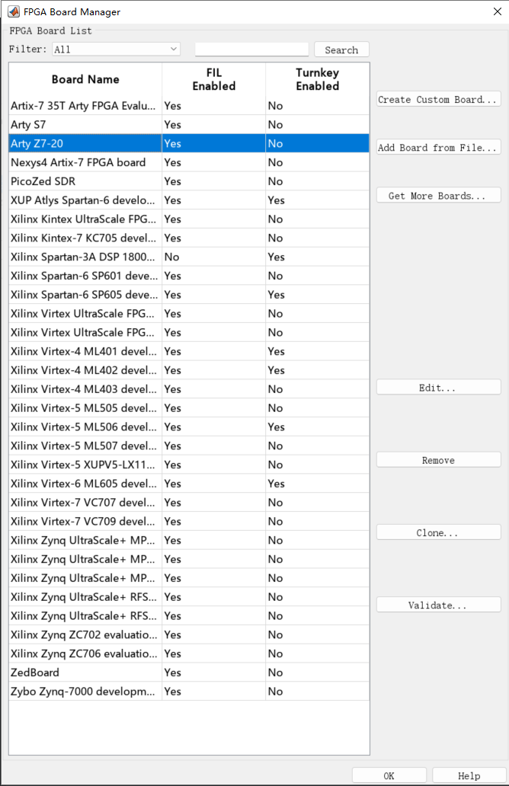
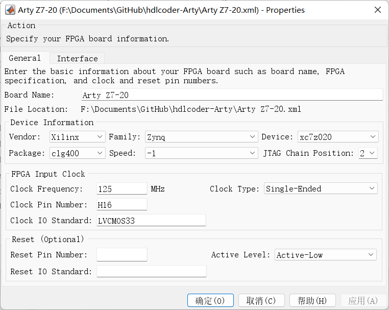
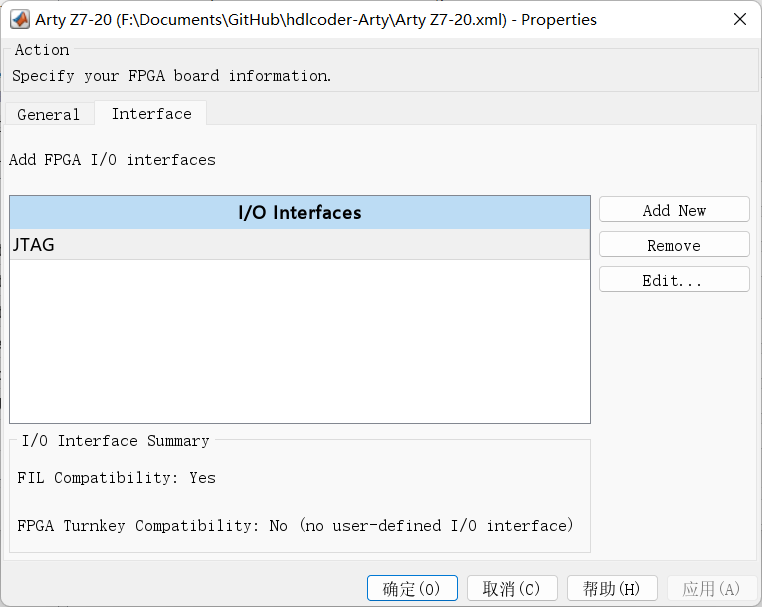
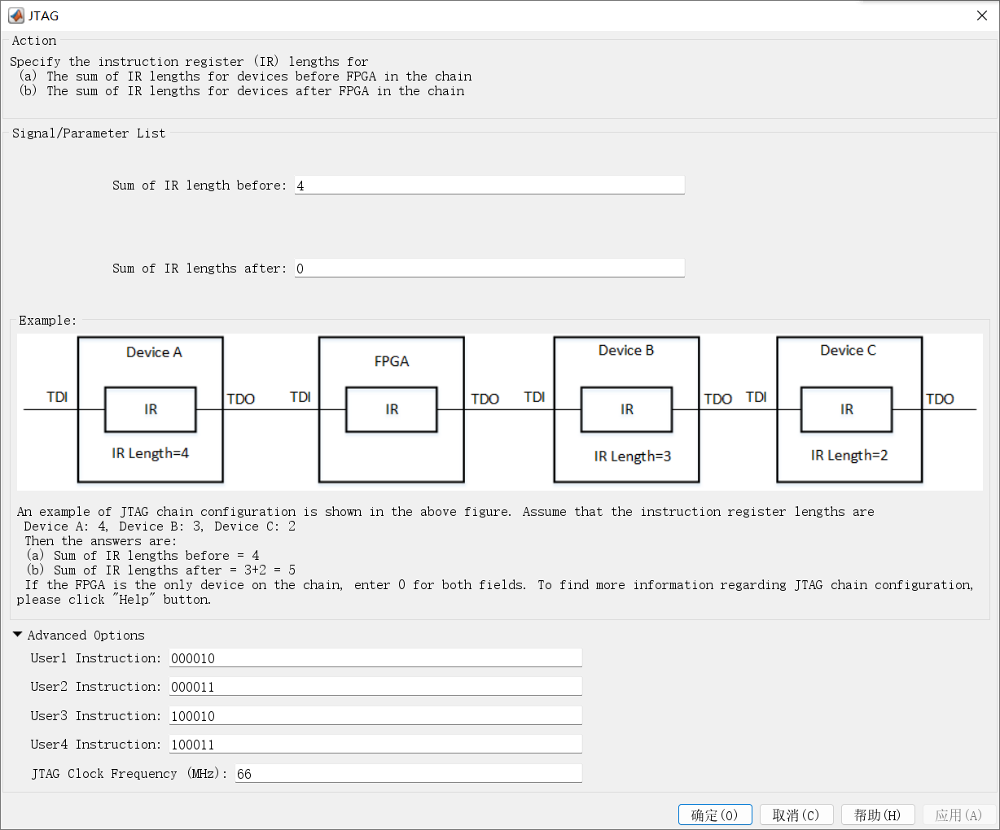

# MATLAB HDL Coder Arty Z7 Board

Arty Z7-20 xc7z020clg400-1

`Arty Z7-20.xml`: FPGA Board Configuration File for FPGA Board Manager

[FPGA Board Editor - MATLAB & Simulink (mathworks.com)](https://www.mathworks.com/help/hdlverifier/ug/fpga-board-editor-reference.html)

[New FPGA Board Wizard - MATLAB & Simulink (mathworks.com)](https://www.mathworks.com/help/releases/R2022b/hdlverifier/ug/new-fpga-board-wizard-reference.html)

[Board registration object that describes SoC custom board - MATLAB (mathworks.com)](https://www.mathworks.com/help/hdlcoder/ref/hdlcoder.board-class.html)

`hdlcoder_board_customization.m`: Board Registration File

`ArtyZ720Registration`: Board Plugin (package folder)

`ArtyZ720Registration/plugin_board.m`: Board Definition

`ArtyZ720Registration/hdlcoder_ref_design_customization.m`: Reference Design Registration File

`ArtyZ720Registration/Vivado2022_1`: Reference Design Plugin (package folder)

`ArtyZ720Registration/Vivado2022_1/plugin_rd.m`: Reference Design Definition

`ArtyZ720Registration/Vivado2022_1/PmodIPs.tcl`[^1]: Reference Design (block design Tcl file)

[Board and Reference Design Registration System - MATLAB & Simulink (mathworks.com)](https://www.mathworks.com/help/releases/R2022b/hdlcoder/ug/board-and-reference-design-system.html)

[Register a Custom Board - MATLAB & Simulink (mathworks.com)](https://www.mathworks.com/help/releases/R2022b/hdlcoder/ug/register-a-custom-board.html)

[Register a Custom Reference Design - MATLAB & Simulink (mathworks.com)](https://www.mathworks.com/help/releases/R2022b/hdlcoder/ug/register-a-custom-reference-design.html)

[Define Custom Board and Reference Design for Zynq Workflow - MATLAB & Simulink (mathworks.com)](https://www.mathworks.com/help/releases/R2022b/hdlcoder/ug/define-and-register-custom-board-and-reference-design-for-zynq-workflow.html)

[Getting Started with Targeting Xilinx Zynq Platform - MATLAB & Simulink (mathworks.com)](https://www.mathworks.com/help/releases/R2022b/hdlcoder/ug/getting-started-with-hardware-software-codesign-workflow-for-xilinx-zynq-platform.html)

Reference:

[^1]: [Getting Started with Digilent Pmod IPs - Digilent Reference](https://digilent.com/reference/learn/programmable-logic/tutorials/pmod-ips/start)